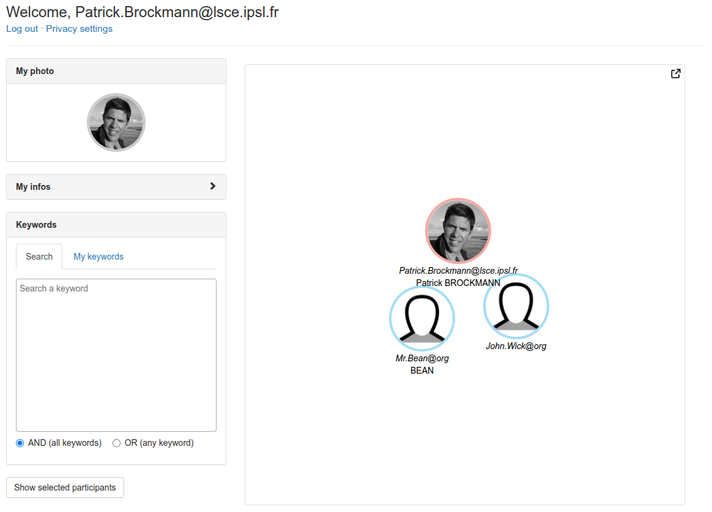

# WeRProject
WeRProject helps you identify and explore project participants through user-defined keywords, with a simple, database-free PHP/HTML/JS architecture and a D3.js network view.

# Description 
WeRProject aims to help users discover and explore participants of a project through the keywords they define. It enables quick identification of people based on acrivities, skills or research topics, and provides a D3.js network view to visually map all participants matching a given search.

From a technical standpoint, the application is a lightweight PHP, HTML and JavaScript solution that operates without a database, relying on a simple directory structure (users/ and faces/). Authentication is handled through an email whitelist combined with two-factor authentication (2FA). A predefined keyword list is included to guide user selections. Each participant supplies a photo, basic profile information and their own keywords once RGPD consent is accepted.

 
